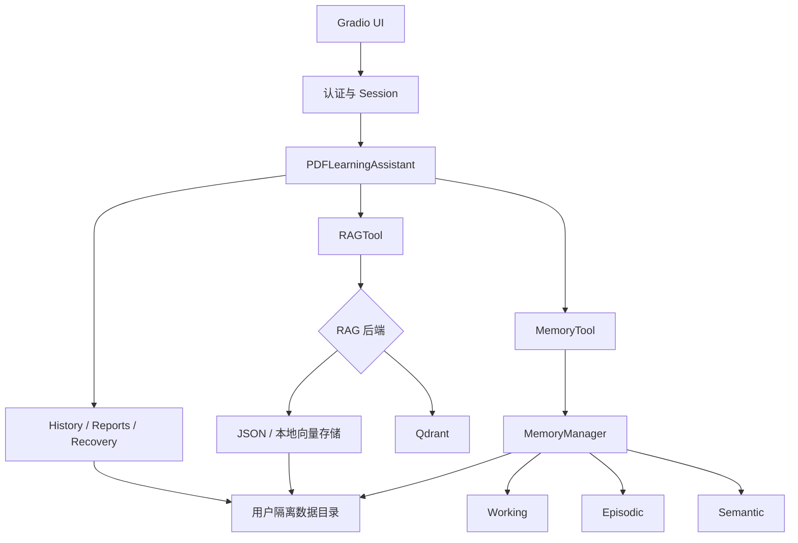

# 智能文档学习助手

一个基于 **Memory + RAG** 的多用户文档学习系统。它围绕“导入文档 → 检索与问答 → 保存学习过程 → 生成报告”形成完整闭环，并通过 Gradio 提供可直接操作的 Web 界面。

当前版本已经实现：

- 用户注册、登录、退出和会话过期管理；
- 用户级文档、RAG、Memory、历史和报告数据隔离；
- PDF、TXT、Markdown（`.md`）和 Word（`.docx`）导入；
- 持久化批量异步导入、阶段进度、失败重试和重启恢复；
- 单文档及多文档联合问答、对比分析和联合总结；
- JSON 本地 RAG 与 Qdrant RAG 后端切换；
- 文档检索、PDF 页码来源、相关度和可复制引用；
- 学习笔记、记忆回忆、学习统计和报告快照；
- Markdown、Word 报告导出；
- 文档删除、全部文档清空和笔记清空；
- 旧版单用户数据迁移；
- History/Memory 损坏检测、隔离、备份和恢复；
- 同一用户多会话写入协调及失败补偿。

## 功能概览

### 多用户与数据隔离

- 用户名使用 NFKC 规范化并执行不区分大小写的唯一性检查；
- 密码使用带随机盐的 `scrypt` 哈希保存，不落盘明文密码；
- 默认会话空闲有效期为 12 小时；
- 每个用户拥有独立的文档、RAG、Memory、历史和报告目录；
- 文件路径必须位于当前用户的数据根目录内；
- 同一用户的并发写入通过共享可重入锁串行化，History 写入前重新加载最新快照；
- RAG 通过用户 namespace 和 `document_id` 双重约束检索与删除范围。

### 文档导入与管理

| 格式 | 扩展名 | 处理方式 |
|---|---|---|
| PDF | `.pdf` | 按页提取文本并保存 `page_number` |
| 文本 | `.txt` | 按文本内容导入 |
| Markdown | `.md` | 按 Markdown 文本导入 |
| Word | `.docx` | 提取非空段落后导入 |

导入流程会生成独立的 `document_id`，保存用户原始文件，切分 Chunk、生成嵌入并写入当前 RAG 后端。支持刷新列表、切换文档、删除所选文档和清空当前用户的全部文档。

> 存储层已预留 `.markdown` 扩展名，但当前 Gradio 上传控件和 RAG 解析入口尚未完整贯通该扩展名，因此端到端支持列表以表格为准。

### Durable batch imports

The upload panel accepts up to 20 PDF, TXT, Markdown, or DOCX files in one
batch. Each file may be at most 100 MiB and a batch may be at most 500 MiB.
The server stages each source and stores its task state in SQLite, so an
accepted import continues after logout or browser close.

- Imports are serial for one user and run for at most four users in parallel.
- Progress reports the durable stages: staging, parsing, chunking, embedding,
  RAG persistence, and committing.
- Transient failures retry after 2, 10, and 30 seconds. Failed files can be
  retried individually or as all failed entries in a batch.
- On restart, a running task with its staged source resumes; a missing staged
  source becomes a failed task. Failed staged files are retained for retry,
  while successful imports remove their staging copy.
- Clearing all documents is unavailable while that user has queued, running,
  or retry-wait import tasks.

The first version intentionally has no cancellation, priority scheduling, or
distributed workers.

### 多文档问答

问答页最多选择 10 篇文档，支持四种模式：

| 模式 | 行为 |
|---|---|
| 自动 | 根据问题自动识别联合问答、对比或总结意图 |
| 联合问答 | 从所有选中文档检索证据后统一回答 |
| 对比分析 | 分文档检索并生成差异、共同点和对应来源 |
| 联合总结 | 分文档抽样总结，再进行汇总归纳 |

总结类问题不会只依赖普通 top-k 结果，而是从文档不同位置抽样；多文档总结采用受控并发的 map-reduce 流程。上下文超出预算时会返回明确的容量提示。

### 检索与引用

- 按所选 `document_id` 范围执行向量检索；
- 展示来源文件、PDF 页码、相关度和内容摘要；
- 对相同来源结果去重；
- 生成可复制的引用格式；
- JSON 和 Qdrant 后端保持一致的检索、统计、删除和清空契约。

### Memory 与学习过程

Memory 系统包含：

- Working Memory：短期工作记忆、容量和过期策略；
- Episodic Memory：事件、会话及学习经历；
- Semantic Memory：事实、概念、实体和关系；
- Perceptual Memory：感知记忆的基础接口。

用户可以添加学习笔记、按关键词回忆历史、查看 Memory/RAG 状态和学习统计。清空笔记只删除 notes，不会误删文档、问答记录或底层全部 Memory。

### 报告、迁移与恢复

- 生成包含文档、问答、笔记、Memory 和 RAG 状态的学习报告；
- 创建不可变 Markdown 报告快照，并按用户保存索引；
- 浏览、查看和下载历史报告；
- 从指定快照导出 Word 报告；
- 扫描并认领旧版 `user123` 单用户数据；
- 迁移通过 staging、校验、发布和失败回滚执行；
- 损坏的 History/Memory 默认阻止继续写入；
- 用户可显式隔离损坏文件、列出自己的备份并执行校验恢复。

## 系统架构



依赖方向保持为：

```text
UI → Session/Runtime → Assistant → Tool → Memory/RAG/Storage
```

底层 Memory、RAG 和 Storage 不应反向依赖 UI 或 Assistant。

## 核心实现目录

```text
python_self_agent/
├── app/                              # 应用服务层
│   ├── auth.py                       # 注册、认证、密码哈希
│   ├── database.py                   # SQLite schema 与事务
│   ├── session.py                    # Session 生命周期
│   ├── runtime.py                    # 用户级共享运行时
│   ├── storage.py                    # 用户目录与路径安全
│   ├── coordination.py               # 同用户写入协调与补偿
│   ├── history.py                    # 学习历史持久化
│   ├── memory_repository.py          # Memory 快照持久化
│   ├── reports.py                    # 报告快照与索引
│   ├── migration.py                  # 旧数据迁移
│   └── recovery.py                   # 损坏数据恢复
├── assistants/
│   ├── pdf_learning_assistant.py     # 学习助手业务用例
│   └── document_selection.py         # 多文档选择范围
├── hello_agents/
│   ├── core/                         # LLM、消息、配置、Agent 抽象
│   ├── agents/                       # Simple/ReAct 等 Agent 示例
│   ├── memory/
│   │   ├── manager.py                # Memory 统一协调
│   │   ├── types/                    # Working/Episodic/Semantic
│   │   ├── rag/
│   │   │   ├── pipeline.py           # JSON RAG 与后端工厂
│   │   │   ├── qdrant_pipeline.py    # Qdrant RAG
│   │   │   ├── prepare.py            # Chunk 与稳定 ID
│   │   │   └── result_utils.py       # 范围、去重、摘要抽样
│   │   ├── graph/
│   │   │   ├── extractor.py          # LLM 图数据抽取、校验与稳定 ID
│   │   │   ├── state.py              # 图谱状态清单与错误脱敏
│   │   │   └── service.py            # 构建、恢复、查询、重试与删除
│   │   └── storage/
│   │       ├── vector_store.py       # 向量库协议及实现
│   │       └── neo4j_store.py        # Neo4j 事务、约束与参数化查询
│   └── tools/builtin/
│       ├── rag_tool.py               # RAG 工具与多文档问答
│       └── memory_tool.py            # Memory 工具
├── ui/
│   └── gradio_app.py                 # Web 页面与事件绑定
├── examples/                         # Memory/RAG/Assistant 示例
├── tests/                            # 单元、契约、集成和验收测试
└── docs/                             # 设计、计划和 Agent 工作流
```

Neo4j 模块已经支持文档图谱构建、状态、恢复、查询、重试和删除。普通、
联合、对比和摘要 `ask` 问答均支持向量结果与文档内图谱上下文的混合检索；
对比和联合摘要还可使用跨文档规范实体，图谱 UI 仍是后续阶段。

## 安装

建议使用 Python 3.10 或更高版本。

```powershell
cd D:\python_self_agent
python -m venv venv
.\venv\Scripts\python.exe -m pip install "gradio==6.19.0" -r requirements.txt
```

后续启动和测试均使用 `venv\Scripts\python.exe`，避免系统 Python、Anaconda
或其他环境缺少项目已声明依赖。

主要依赖：

- Gradio 6.19.0 (`gradio==6.19.0`)
- OpenAI Python SDK
- pypdf
- python-docx
- python-dotenv
- qdrant-client
- neo4j Python Driver
- pytest

## 配置

在项目根目录创建 `.env`。该文件已被 Git 忽略，不要提交真实密钥。

### LLM

```env
LLM_API_KEY=your-api-key
LLM_BASE_URL=https://api.deepseek.com/v1
LLM_MODEL_ID=deepseek-chat

LLM_MAX_RETRIES=2
LLM_RETRY_BACKOFF=0.5
LLM_CONTEXT_WINDOW_TOKENS=8192
LLM_OUTPUT_RESERVED_TOKENS=1024
LLM_CONTEXT_SAFETY_MARGIN_TOKENS=512
```

`HelloAgentsLLM` 同时兼容 `OPENAI_API_KEY`、`OPENAI_BASE_URL` 和 `OPENAI_MODEL`。

### RAG 后端

默认使用本地 JSON：

```env
RAG_BACKEND=json
```

使用 Qdrant：

```env
RAG_BACKEND=qdrant
QDRANT_URL=http://localhost:6333
QDRANT_API_KEY=
QDRANT_COLLECTION=doc_learning_vectors
```

注意：

- `RAG_BACKEND` 只接受 `json` 或 `qdrant`；
- `qdrant` 模式必须配置 `QDRANT_URL`；
- collection 名称仅允许字母、数字、下划线和连字符，最长 255 个字符；
- JSON 和 Qdrant 不会双写，也不会自动迁移彼此已有数据；
- Qdrant 的 collection、向量维度和距离配置不兼容时会显式失败；
- Qdrant 错误消息会清理 URL 凭据和 API Key。

### Neo4j 文档图谱

配置完整时，文档成功进入 RAG 后会同步尝试构建 Neo4j 图谱：

```env
NEO4J_URI=neo4j://127.0.0.1:7687
NEO4J_USERNAME=neo4j
NEO4J_PASSWORD=your-password
NEO4J_DATABASE=neo4j
```

图谱写入采用弱一致性：LLM 抽取或 Neo4j 写入失败不会撤销已经成功的文档导入；状态会记录为 `failed` 并允许显式重试。删除时先删除 RAG 数据，再清理目标图；清理失败记录为 `cleanup_pending`。所有 Neo4j 读写同时按 `rag_namespace` 和 `document_id` 隔离。

`RAGTool` 提供以下图谱 action：

- `graph_status`
- `get_document_graph`
- `get_chapter_tree`
- `get_concept_relations`
- `get_knowledge_dependencies`
- `get_person_relations`
- `retry_document_graph`
- `delete_document_graph`

所有 action 都要求 `document_id`。完整图查询默认不返回 `Chunk.content`，只有显式设置 `include_chunk_content=true` 才返回正文。当前并发保护仅覆盖单进程/单 worker；多 worker 部署需要分布式锁后才能启用自动建图。

普通、联合、对比和摘要 `ask` 均支持 `graph_mode`：

- `auto`（默认）：图谱 ready 时追加受限的一跳实体/关系上下文；图谱不可用
  时自动回退到原有向量 RAG。
- `off`：不查询 Neo4j。
- `required`：必须取得图谱上下文，否则在调用回答 LLM 前明确失败。

图谱上下文使用稳定的 `G-*` 引用 ID，向量 Chunk 继续使用 `S-*`。可以通过
`graph_node_limit` 和 `graph_relation_limit` 调整上限；图查询不会返回
Chunk 正文。对比模式的结构化输出可以引用 `S-*` 或 `G-*`；摘要模式在
逐文档 map 阶段加入该文档图谱，缓存键包含图上下文指纹，并在 reduce
阶段只允许使用各单篇摘要明确列出的引用。

### 数据目录

默认运行数据根目录为项目下的 `data/`，可以覆盖：

```env
PDF_ASSISTANT_DATA_DIR=D:\document-assistant-data
```

## 运行

启动 Gradio 应用：

```powershell
.\venv\Scripts\python.exe .\ui\gradio_app.py
```

默认地址：

```text
http://127.0.0.1:7860
```

`main.py` 是早期单 Agent 演示入口，不是当前多用户 Web 应用入口。

## Docker 单节点部署

目标是单台 Linux 云主机或内网服务器上的单副本 Compose 部署。默认启动
Gradio 应用和 Qdrant，Neo4j 通过 `graph` Profile 按需启动；只有应用端口
发布到宿主机，数据保存在 `deploy-data/`。

```sh
cp deploy/.env.example deploy/.env
# 编辑 deploy/.env，设置 LLM_API_KEY、LLM_BASE_URL 和 LLM_MODEL_ID
docker compose --env-file deploy/.env up -d --build
python3 deploy/smoke_test.py --env-file deploy/.env
```

完整的内网防火墙、Neo4j Profile、冷备份/恢复和故障处理说明见
[`deploy/README.md`](deploy/README.md)。该部署保持单副本、单 worker，直接
HTTP 仅适用于受控内网；公网访问必须由外部 HTTPS 网关保护。

## 使用流程

1. 注册或登录。用户名长度为 3–32，密码长度为 8–128。
2. 上传 PDF、TXT、MD 或 DOCX 文档。
3. 在问答页选择一篇或多篇文档。
4. 选择自动、联合问答、对比分析或联合总结模式。
5. 在检索页查看命中片段、来源、页码和引用格式。
6. 添加学习笔记并按关键词回忆。
7. 查看学习统计和生成报告。
8. 保存 Markdown 快照或导出 Word。
9. 按需删除文档、清空文档或只清空学习笔记。
10. 如果旧版数据或损坏快照存在，在报告页展开迁移/恢复面板处理。

## 数据布局

默认布局：

```text
data/
├── app.db
├── uploads/
└── users/
    └── <user_id>/
        ├── documents/
        │   └── <document_id>.<suffix>
        ├── rag/
        │   ├── rag_cache.json
        │   └── .graph/
        │       └── <rag_namespace>.json
        ├── history.json
        ├── memory/
        │   └── memories.json
        └── reports/
            ├── <report_id>.md
            └── <report_id>.docx
```

JSON 与文本写入采用临时文件加原子替换。History 和 Memory 恢复会验证 schema 与用户所有权，跨用户备份不能恢复。

## 测试

运行完整测试：

```powershell
New-Item -ItemType Directory -Force .runtime\pytest-tmp | Out-Null
$env:TEMP=(Resolve-Path '.runtime\pytest-tmp').Path
$env:TMP=$env:TEMP
.\venv\Scripts\python.exe -m pytest -q
```

测试覆盖：

- 注册、认证、Session 过期和会话上限；
- 用户目录、路径穿越防护和跨用户隔离；
- 多会话 History 合并与写入协调；
- 文档导入、选择、删除和原始文件清理；
- 单文档/多文档 RAG 范围；
- JSON/Qdrant 后端契约；
- Neo4j 参数化查询、原子替换、图谱状态恢复、GraphRAG 混合上下文与租户隔离；
- Qdrant 重试、错误映射、密钥清理和批量写入；
- Memory 向量存储与降级；
- 报告快照、跨用户访问防护；
- 旧数据迁移、回滚和恢复；
- History/Memory 损坏隔离与恢复；
- Gradio 已认证处理器。

真实 Qdrant 集成测试需要配置可访问的 Qdrant 服务；未配置时相关测试会跳过。

Windows 开发环境可以使用仓库提供的临时测试服务脚本：

```powershell
.\venv\Scripts\python.exe -m pip install qdrant-client==1.18.0
powershell -ExecutionPolicy Bypass -File scripts\run_qdrant_integration.ps1
```

脚本下载官方 Qdrant v1.18.2 Windows x86-64 二进制，在
`127.0.0.1:6333` 临时启动服务并运行真实集成测试，最后停止它启动的
进程。下载、数据和日志位于已忽略的 `.runtime/`，不会进入版本控制。

真实 Neo4j 集成测试需要设置 `NEO4J_TEST_URI`、`NEO4J_TEST_PASSWORD`，并可选设置 `NEO4J_TEST_USERNAME` 与 `NEO4J_TEST_DATABASE`；未配置 URI 时测试会明确跳过。

## 关键数据规则

1. 所有文档操作必须携带并过滤 `document_id`。
2. 所有用户数据必须位于对应 `user_id` 根目录或 namespace 内。
3. PDF Chunk 必须保留来源文件和页码。
4. 总结类问题必须跨文档位置抽样，不能只依赖局部 top-k。
5. 删除当前文档只删除目标文档及关联问答。
6. 清空文档默认保留学习笔记。
7. 清空笔记不得删除文档、问答或整个 Memory。
8. 数据损坏时默认 fail closed，必须显式恢复后才能继续写入。
9. 外部服务错误不得向 UI 泄露 API Key 或带凭据 URL。
10. 图谱读写必须同时按 `rag_namespace` 和 `document_id` 过滤。

## 当前状态与后续方向

已完成的工程升级：

- JSON/Qdrant RAG 后端切换；
- Qdrant payload 范围过滤和 collection 管理；
- 多用户认证、会话与数据隔离；
- 多文档联合问答、对比和总结；
- 用户级并发写协调；
- Neo4j 文档图谱构建、查询、恢复、重试、定向删除及全问答模式混合检索；
- 旧数据迁移和损坏数据恢复；
- 较完整的单元、契约、集成和验收测试。

后续可继续推进：

- GraphRAG 图谱可视化与实体人工复核 UI；
- 文档命中高亮与引用一键复制；
- 学习计划、间隔复习和知识掌握度；
- 自动生成知识卡片与练习题；
- Docker、云端或内网部署；
- 将 `.markdown` 扩展名贯通 UI 和 RAG 解析链路。

## 仓库工作约定

开始修改前请阅读 `PROJECT_KNOWLEDGE.md`。当历史说明与当前仓库冲突时，以当前代码、测试、配置和运行结果为准。

涉及 Superpowers 实施计划评审时，遵循 `docs/agent-workflow/README.md`。

## GraphRAG 跨文档规范实体

- GraphRAG 跨文档实体层：文档本地 `Concept`、`Person`、`KnowledgePoint`
  通过 Neo4j `REFERS_TO` 连接到命名空间级 `CanonicalEntity`。
- 规范实体唯一键为 `rag_namespace + entity_type + normalized_name`；只做
  确定性的标准化名称匹配，不做模糊或 LLM 自动合并。
- 替换/删除文档时只删除文档本地节点，并在同一事务中清理无引用的规范
  实体；跨文档查询始终限定在显式 `document_ids` 内。
- 对比问答会将共享实体加入主上下文；联合摘要只把共享实体加入 reduce
  阶段，不会污染单文档 map 摘要。共享实体继续使用稳定的 `G-*` 引用。
- 旧图即使尚未建立 `REFERS_TO`，查询也会按实体类型和标准化名称进行
  只读分组，因此不要求破坏性迁移。
