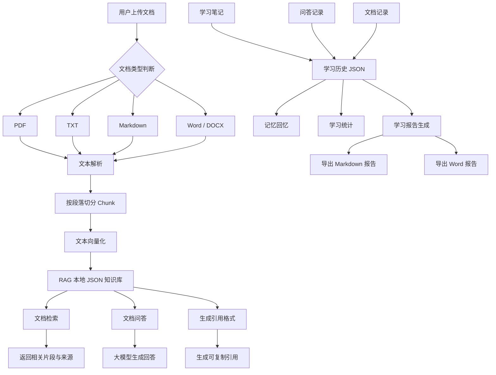

# 智能文档学习助手

这是一个基于 Memory + RAG 的智能文档学习助手，支持 PDF、TXT、Markdown、Word 文档导入，并提供文档问答、文档检索、学习笔记、记忆回忆、学习统计、学习报告导出等功能。

---

## 功能特性

* PDF / TXT / Markdown / Word 文档上传与解析
* 多文档下拉选择
* 当前文档隔离问答
* 文档检索与来源显示
* PDF 页码级引用来源
* 文档检索结果按页去重
* 可复制引用格式生成
* 学习笔记保存
* 清空全部学习笔记
* 记忆回忆
* 学习统计
* 学习报告生成
* Markdown 报告导出
* Word 报告导出
* 删除当前文档
* 清空全部文档
* RAG JSON 本地持久化
* 学习历史 JSON 本地持久化
* 总结类问题自动启用全文抽样摘要模式
* 按段落 + overlap 的 chunk 切分优化

---

## 支持的文档格式

当前支持以下文档格式：

```text
.pdf
.txt
.md
.markdown
.docx
```

不同格式的处理方式：

```text
PDF：按页读取，并保留页码来源
TXT：按文本内容直接导入
Markdown：按 Markdown 文本导入
Word：读取 docx 段落文本后导入
```

---

## 安装依赖

建议先进入项目目录：

```powershell
cd D:\python_self_agent
```

然后安装依赖：

```powershell
D:\Anaconda\python.exe -m pip install -r requirements.txt
```

推荐的精简版 `requirements.txt`：

```txt
gradio>=4.0.0
pypdf>=4.0.0
python-docx>=1.1.0
python-dotenv>=1.0.0
openai>=1.0.0
```

---

## 运行方式

进入项目目录后，运行 Gradio 应用：

```powershell
D:\Anaconda\python.exe D:\python_self_agent\ui\gradio_app.py
```

运行成功后，终端会出现类似：

```text
Running on local URL: http://127.0.0.1:7860
```

---

## 浏览器访问

运行 Gradio 应用后，浏览器打开：

```text
http://127.0.0.1:7860
```

---

## 系统流程图



---

## 项目结构

```text
D:\python_self_agent
├── assistants
│   └── pdf_learning_assistant.py
├── hello_agents
│   ├── memory
│   │   ├── rag
│   │   │   └── pipeline.py
│   │   └── ...
│   └── tools
│       └── builtin
│           ├── memory_tool.py
│           └── rag_tool.py
├── ui
│   └── gradio_app.py
├── knowledge_base
│   └── rag_cache
├── memory_data
├── reports
├── requirements.txt
├── PROJECT_DEMO.md
└── README.md
```

---

## 核心文件说明

### `assistants/pdf_learning_assistant.py`

负责整合 MemoryTool 和 RAGTool，提供智能文档学习助手的核心能力，包括：

* 加载文档
* 基于当前文档问答
* 文档检索
* 学习笔记
* 清空学习笔记
* 记忆回忆
* 学习统计
* 学习报告生成
* Markdown / Word 报告导出
* 删除当前文档
* 清空全部文档

### `hello_agents/tools/builtin/rag_tool.py`

负责 RAG 工具入口，支持：

* 添加文本知识
* 添加本地文档
* 搜索知识库
* 基于检索结果问答
* 生成可复制引用格式
* 删除指定文档
* 清空知识库
* 显示参考来源和页码

### `hello_agents/memory/rag/pipeline.py`

负责 RAG 管道，包括：

* 文本切分
* 向量化
* 本地 JSON 持久化
* 检索
* 按页去重
* 删除指定文档 chunks
* 清空全部 chunks
* 总结类问题的全文抽样上下文获取

### `ui/gradio_app.py`

负责 Web 页面交互，包括：

* 文档上传
* 多文档下拉选择
* 文档问答
* 文档检索
* 引用格式生成
* 学习笔记
* 清空学习笔记
* 记忆回忆
* 学习统计
* 学习报告
* Markdown / Word 报告下载
* 删除当前文档
* 清空全部文档

---

## 环境变量

需要在项目根目录下创建 `.env` 文件，并配置大模型 API：

```env
LLM_API_KEY=你的API Key
LLM_BASE_URL=https://api.deepseek.com/v1
LLM_MODEL_ID=deepseek-chat
```

如果你使用的是 DeepSeek Reasoner，也可以写成：

```env
LLM_API_KEY=你的API Key
LLM_BASE_URL=https://api.deepseek.com/v1
LLM_MODEL_ID=deepseek-reasoner
```

---

## 使用流程

启动项目后，可以按照下面流程使用：

```text
1. 上传文档
2. 选择当前文档
3. 文档问答
4. 文档检索
5. 生成引用格式
6. 添加学习笔记
7. 记忆回忆
8. 查看学习统计
9. 生成学习报告
10. 导出 Markdown 报告
11. 导出 Word 报告
12. 删除当前文档
13. 清空全部文档
14. 清空全部学习笔记
```

---

## 功能说明

### 1. 上传文档

在“上传文档”页面选择本地文档文件，点击“导入文档”。

系统会自动完成：

```text
文档读取
文本提取
文本切分
向量化
写入本地 RAG 缓存
刷新文档下拉框
```

当前支持：

```text
PDF
TXT
Markdown
Word / DOCX
```

---

### 2. 文档问答

在“文档问答”页面选择当前文档，然后输入问题。

示例问题：

```text
这个文档主要讲了什么？
请总结这个文档的核心内容
某个概念是什么意思？
某个人物是谁？
RAG 的核心流程是什么？
```

对于总结类问题，系统会自动启用全文抽样摘要模式。

---

### 3. 文档检索

在“文档检索”页面选择当前文档，然后输入关键词。

示例关键词：

```text
RAG
LLM
SFT
Poirot
自由
亲子沟通
向量化
相似度检索
```

检索结果会显示：

```text
当前检索文档
document_id
相似度分数
来源文件
页码信息
内容摘要
```

PDF 文档会显示页码来源；TXT、Markdown、Word 文档没有页码时会显示文档来源。

---

### 4. 生成引用格式

在“文档检索”页面输入关键词后，点击“生成引用格式”。

系统会生成可复制的引用内容，例如：

```text
1. 《test_word.docx》，未知页码。
相关度：0.1616
引用内容：RAG 是检索增强生成技术。它的核心流程包括：文档切分、向量化、相似度检索、基于上下文生成答案。
```

该功能适合用于学习笔记、报告整理和资料引用。

---

### 5. 学习笔记

可以为某个概念添加学习笔记。

示例：

```text
概念：RAG
笔记：RAG 的核心是先检索相关资料，再让大模型基于资料生成答案。
```

学习笔记会保存到学习历史中，并可在“记忆回忆”和“学习报告”中查看。

---

### 6. 清空全部学习笔记

在“学习笔记”页面点击“清空全部学习笔记”。

系统会清空本地学习历史中的 notes，但不会删除：

```text
当前文档
RAG 知识库
历史问答记录
文档导入记录
```

---

### 7. 记忆回忆

可以根据关键词回忆历史学习内容。

系统会同时查询：

```text
当前记忆系统
本地学习历史 JSON
历史问答记录
历史学习笔记
历史文档记录
```

---

### 8. 学习统计

可以查看当前系统状态，包括：

```text
当前用户
当前 session
当前文档
当前 document_id
已导入文档数
提问次数
学习笔记数
Memory 状态
RAG 知识库状态
```

---

### 9. 学习报告

可以生成完整学习报告，内容包括：

```text
学习基本信息
最近导入文档
记忆系统状态
RAG 知识库状态
最近问答记录
最近学习笔记
推荐复习方向
```

报告支持导出为：

```text
Markdown 文件
Word 文件
```

---

## 数据持久化说明

项目使用本地 JSON 文件进行持久化。

### RAG 知识库缓存

默认保存位置：

```text
D:\python_self_agent\knowledge_base\rag_cache
```

用于保存文档切分后的 chunk 和向量数据。

### 学习历史

默认保存位置：

```text
D:\python_self_agent\memory_data
```

用于保存：

```text
历史导入文档
历史问答
学习笔记
session 信息
```

### 学习报告

默认保存位置：

```text
D:\python_self_agent\reports
```

用于保存导出的：

```text
Markdown 学习报告
Word 学习报告
```

---

## 重新测试启动

修改依赖或代码后，可以重新启动项目：

```powershell
D:\Anaconda\python.exe D:\python_self_agent\ui\gradio_app.py
```

如果浏览器可以正常打开：

```text
http://127.0.0.1:7860
```

并且页面正常显示，说明项目启动成功。

---

## 最终测试流程

整理项目文档前，建议完整测试一遍以下流程：

```text
1. 上传 PDF
2. 上传 TXT
3. 上传 Markdown
4. 上传 Word / DOCX
5. 切换当前文档
6. 文档问答
7. 文档检索
8. 生成引用格式
9. 添加学习笔记
10. 记忆回忆
11. 查看学习统计
12. 生成学习报告
13. 导出 Markdown
14. 导出 Word
15. 删除当前文档
16. 清空全部文档
17. 清空全部学习笔记
```

如果以上流程都能正常执行，说明项目已经具备完整的智能文档学习助手功能闭环。

---

## 当前已完成的质量优化

* PDF 按页读取
* TXT 文本导入
* Markdown 文本导入
* Word / DOCX 段落文本导入
* chunk 按段落切分
* chunk overlap 重叠窗口
* 总结类问题自动扩大检索范围
* 总结类问题启用全文抽样模式
* 文档检索结果按页去重
* 检索结果显示来源
* PDF 检索结果显示页码
* 多文档 document_id 隔离检索
* 可复制引用格式生成
* RAG JSON 本地持久化
* 学习历史 JSON 本地持久化
* Markdown 学习报告导出
* Word 学习报告导出

---

## 后续优化方向

后续可以继续优化：

```text
1. 接入真正的 Qdrant 向量数据库
2. 接入 Neo4j 知识图谱
3. 增加多用户登录和用户隔离
4. 增加学习计划和复习提醒
5. 美化 Word 报告格式
6. 增加引用复制按钮
7. 增加检索相似度阈值调节
8. 支持多文档联合问答
9. 支持学习报告自动生成目录
10. 优化系统流程图与项目展示材料
```

---

## 项目定位

本项目可以作为：

```text
AI Agent 项目实践
RAG 检索增强生成项目
Memory + RAG 综合实验
智能文档问答助手
AI 学习助手
课程设计 / 毕业设计 / 简历项目
面试展示项目
```
