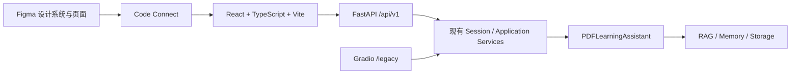

# 知研 Figma 产品化 UI 设计

## 1. 目标

将当前基于 Gradio 的多用户文档学习助手产品化为“知研”Web 应用。首版围绕核心产品闭环建立 Figma 设计系统、React 前端、FastAPI 薄接口和浏览器级验证，并保留现有 Gradio 作为一个发布周期的兼容回退入口。

产品名称为“知研”，副标题为“智能文档学习助手”。视觉方向采用“知识工作台 + 松绿学术”。

## 2. 已确认的产品决策

- 首版范围：登录、文档导入与管理、智能问答、文献检索、学习笔记、学习统计和学习报告。
- 新前端：React + TypeScript + Vite。
- 新接口层：FastAPI `/api/v1` 薄接口，不复制现有业务逻辑。
- 数据请求：TanStack Query 管理服务端状态、缓存和有条件轮询。
- 路由：React Router 管理产品页面。
- 迁移方式：按垂直切片逐步打通完整用户流程。
- 兼容方式：React 完成核心功能对等后成为默认入口，Gradio 在 `/legacy` 保留一个发布周期。
- 响应式：桌面、平板、手机三档完整支持。
- 视觉方向：固定侧栏知识工作台，松绿学术色板。
- Figma 是 Token、组件状态、响应式页面和交付说明的设计来源。
- 首版运行约束：单进程、单 Uvicorn Worker，保持当前任务队列和用户级协调语义。

## 3. 范围

### 3.1 首版包含

1. 注册、登录、退出和会话过期处理。
2. 文档列表、批量上传、后台导入进度、失败重试和文档删除。
3. 1–10 篇文档的普通问答、联合问答、对比分析和联合总结。
4. 后台总结任务的启动、查询和取消。
5. 多文档检索、来源、页码、相关度和可复制引用。
6. 学习笔记的添加、浏览和清空。
7. 学习统计、报告生成、报告历史、查看和下载。
8. 桌面、平板和手机布局。
9. 加载、空数据、失败、无权限、会话过期、后台任务和危险操作确认状态。
10. React 组件与 Figma 组件的 Code Connect 映射。
11. Python、前端单元、Playwright、视觉回归和无障碍验证。

### 3.2 首版不包含

- 旧数据迁移操作的新 React 页面。
- History/Memory 损坏隔离与恢复的新 React 页面。
- GraphRAG 图谱可视化或实体人工复核 UI。
- 学习计划、间隔复习、知识卡片和练习题的新 UI。
- 多进程 Worker、Redis、Celery 或分布式会话迁移。
- 移除 Gradio。
- 重写 RAG、Memory、报告、导入队列或用户存储业务规则。

低频迁移、恢复和其他运维功能在首版继续由 `/legacy` 提供。

## 4. 架构



依赖方向保持为：

```text
React / Gradio -> FastAPI 或 UI Adapter -> Application Services
-> Assistant -> Tool -> Memory/RAG/Storage
```

FastAPI 只负责：

- HTTP 请求和响应 DTO；
- Cookie、CSRF 和会话解析；
- 输入校验；
- 授权边界；
- 稳定错误映射；
- 文件上传与下载的 HTTP 表达。

FastAPI 不实现新的 RAG 检索、问答、导入、报告或存储规则。React 和 Gradio 使用同一服务初始化、数据库、用户数据根目录、任务仓储和 Worker 生命周期。

## 5. 垂直切片顺序

1. Figma Foundations、公共组件和 React 应用壳。
2. FastAPI 共享启动与认证切片。
3. 文档库、批量导入和进度切片。
4. 智能问答、结构化来源和后台总结切片。
5. 文献检索和引用切片。
6. 学习笔记切片。
7. 学习洞察中的统计和报告切片。
8. 三档响应式、Code Connect、完整 Playwright 和默认入口切换。

每个切片必须形成可运行、可独立测试的用户能力，不能先一次性重写全部 API 后再开始前端。

## 6. 信息架构

### 6.1 桌面和平板导航

新前端侧边导航包含：

1. 概览；
2. 文档库；
3. 智能问答；
4. 文献检索；
5. 学习笔记；
6. 学习洞察。

“学习洞察”内部使用“学习统计”和“学习报告”两个页签，避免侧边导航继续膨胀。

### 6.2 手机导航

手机底部导航包含：

1. 概览；
2. 文档；
3. 问答；
4. 检索；
5. 更多。

“更多”承载学习笔记和学习洞察。登录、设置、退出等账户操作不占用底部主导航位置。

## 7. Figma 文件结构

Figma 设计文件命名为“知研 · 智能文档学习助手”，包含：

- `00 Foundations`：颜色、字体、间距、圆角、阴影、栅格、断点和无障碍规范。
- `01 Components`：公共组件及其 Variant、状态和尺寸。
- `02 Desktop`：桌面关键页面和状态。
- `03 Tablet`：平板关键页面和状态。
- `04 Mobile`：手机关键页面和状态。
- `05 States`：跨页面加载、空数据、失败、权限、会话和确认状态。
- `06 Handoff`：组件说明、交互规则、响应式规则和 Code Connect 状态。

## 8. 视觉基础

### 8.1 颜色

核心颜色 Token：

| Token | 值 | 用途 |
|---|---:|---|
| `brand-600` | `#287A60` | 主按钮、选中状态、品牌标识 |
| `brand-700` | `#1F634D` | Hover、强调文字、深色状态 |
| `brand-100` | `#E6F3ED` | 柔和选中背景、AI 回答背景 |
| `canvas` | `#F5F8F6` | 页面背景 |
| `surface` | `#FFFFFF` | 卡片、弹层和输入面 |
| `text-primary` | `#263B34` | 正文和标题 |
| `text-secondary` | `#71847C` | 次要信息 |
| `border` | `#DCE7E1` | 分隔线和控件边界 |

信息、成功、警告和危险色必须拥有独立 Token，且状态不能只依赖颜色表达。

### 8.2 排版

- 拉丁字符和数字使用 Inter。
- 中文使用 Noto Sans SC。
- 正文优先阅读性，保持稳定行高和合理行宽。
- 标题、正文、辅助文字、代码和数据数值形成明确层级。

### 8.3 几何

- 基础间距单位为 4px。
- 常用圆角为 8px、12px 和 16px。
- 阴影保持克制，仅用于需要层级区分的浮层、抽屉和必要卡片。
- 所有文本和交互状态满足 WCAG AA 对比度。

## 9. 公共组件

首版 Figma 与 React 都必须提供：

- Button；
- IconButton；
- TextInput、PasswordInput、Textarea；
- Select、MultiSelect、Checkbox、Radio；
- FileDropzone；
- ProgressBar；
- StatusBadge；
- AppShell、Sidebar、BottomNavigation、TopBar；
- DocumentRow、DocumentPicker；
- ChatMessage、QuestionComposer；
- SourceCard、CitationBlock；
- NoteCard；
- StatCard、ReportRow；
- Table；
- EmptyState、LoadingState、ErrorState；
- Toast；
- Dialog、Drawer；
- Tabs；
- Pagination 或受控列表加载组件，仅在对应页面确有需要时使用。

每个组件只实现当前页面需要的 Variant。禁止为假想的未来场景建立无消费者的组件和属性。

## 10. 页面设计

### 10.1 登录

- 展示“知研”和“智能文档学习助手”。
- 登录与注册通过清晰页签或模式切换完成。
- 字段附近显示校验错误。
- 会话过期后保留原目标页面，重新登录成功后返回。

### 10.2 概览

- 最近文档；
- 活动导入任务；
- 最近学习统计摘要；
- 返回上次学习位置的明确动作。

概览不展示与用户任务无关的填充指标。

### 10.3 文档库

- 文件拖放和多文件选择；
- 浏览器上传、服务端暂存和后台导入三个阶段的清晰文案；
- 批次与单文件进度；
- 失败摘要和可重试操作；
- 文档列表、状态、格式、导入时间和删除；
- 删除确认明确说明影响范围。

### 10.4 智能问答

- 桌面端左侧导航、中央对话、右侧来源三栏；
- 文档选择与问答模式位于页面上下文区域；
- 回答与来源拥有稳定关联；
- 后台联合总结显示状态、进度、刷新和取消；
- 引用来源展示文档名、页码或章节、摘要和复制操作。

### 10.5 文献检索

- 多文档选择；
- 关键词输入；
- 命中结果、来源、页码、相关度和摘要；
- 引用生成和复制；
- 空结果与容量错误拥有可操作提示。

### 10.6 学习笔记

- 笔记与可选概念输入；
- 最近笔记列表；
- 添加成功状态；
- 清空全部笔记的危险操作确认；
- 明确说明清空笔记不会删除文档或问答。

### 10.7 学习洞察

- “学习统计”和“学习报告”两个页签；
- 统计只呈现现有系统能够可靠计算的指标；
- 报告支持生成、历史列表、查看和 Markdown/Word 下载；
- 生成和下载失败使用统一错误语义。

## 11. 响应式规则

### 11.1 桌面

- 基准视口：`1440x1024`。
- 展开侧栏。
- 智能问答的中央内容和来源面板并列。
- 对话输入区域保持可见，但不得用遮挡内容的固定定位。

### 11.2 平板

- 基准视口：`1024x768`。
- 侧栏收缩为图标栏。
- 来源面板改为可展开 Drawer。
- 表格优先保留关键信息，次要字段进入详情或换行。

### 11.3 手机

- 基准视口：`390x844`。
- 使用底部导航。
- 智能问答占满主内容宽度。
- 文档选择和来源分别使用底部 Drawer。
- 所有核心操作可在单手可达区域找到。
- 禁止非预期横向滚动、内容裁切和交互重叠。

## 12. API 设计

API 统一使用 `/api/v1` 前缀：

- `/auth/*`：注册、登录、退出和当前会话；
- `/documents/*`：文档列表、批量导入、批次、任务重试和删除；
- `/qa/*`：问答、对比、总结任务、查询和取消；
- `/search`：多文档检索和结构化来源；
- `/notes/*`：笔记列表、添加和清空；
- `/insights/*`：统计、报告生成、历史、查看和下载。

路由的具体 HTTP 方法和 DTO 在实施计划中逐项定义，但必须满足以下不变量：

- 公开接口不接受调用方任意指定 `user_id`；
- 服务端从会话解析当前用户；
- 文档作用域继续使用稳定 `document_id`；
- 删除和查询按用户及文档双重约束；
- 下载接口不返回服务器绝对路径；
- API 响应不包含凭据、带凭据 URL 或内部堆栈。

## 13. 认证与会话

- 浏览器使用 `HttpOnly` 会话 Cookie。
- Cookie 使用 `SameSite`；生产 HTTPS 环境启用 `Secure`。
- 变更请求携带服务端签发的 CSRF Token。
- 内部继续复用现有 `SessionRegistry` 和会话过期规则。
- `401` 触发会话过期体验并返回登录页。
- 登录成功后返回用户原目标页面。
- React 不持久化服务器会话令牌到 Local Storage。

## 14. 数据流

### 14.1 启动

React 首次加载请求当前会话。成功后加载必要的页面级数据；未认证时进入登录页。页面不得在应用启动时一次性请求所有模块数据。

### 14.2 导入

上传使用 multipart。服务端继续复用当前安全暂存、任务仓储、Worker、固定重试和恢复语义。前端只在当前用户存在活动任务时轮询，终态后停止。

### 14.3 问答

请求携带 1–10 个 `document_id` 和问答模式。响应提供结构化回答、模式、来源、页码或章节、引用文本和任务状态。普通问答同步完成；现有后台总结继续使用任务 ID、进度查询和取消。

### 14.4 下载

报告通过受认证下载端点返回并设置安全的 `Content-Disposition`。前端永远不接收或拼接服务器路径。

## 15. 错误处理

统一错误响应：

```json
{
  "error": {
    "code": "stable_error_code",
    "message": "可操作的用户提示",
    "retryable": false,
    "field_errors": {}
  }
}
```

状态语义：

- `401`：会话过期，进入重新登录流程；
- `403`：权限不足，不自动重试；
- `409`：任务或数据状态冲突，提供刷新；
- `422`：字段级输入错误；
- `429`、`503`：仅在 `retryable=true` 时提供重试；
- 未知错误：通用提示，记录服务端诊断信息但不向 UI 泄露。

危险操作使用统一确认对话框，并清楚写明“会删除什么”和“不会删除什么”。

## 16. Figma 到代码工作流

1. 在 Figma 中创建 Foundations 和变量集合。
2. 依赖变量构建公共组件和必要 Variant。
3. 用组件组合桌面关键页面。
4. 根据明确响应式规则组合平板和手机页面。
5. 为每个待实现页面使用精确节点链接。
6. Codex 先读取 `get_design_context` 和节点截图，再编码。
7. 若上下文过大，先读取 metadata，再按所需节点拆分读取。
8. Figma 返回的真实 SVG 和图片直接保存到受控前端资源目录，不使用占位图或额外图标包替代。
9. React 公共组件稳定后，为已发布 Figma 组件建立 Code Connect 映射。
10. 浏览器截图与 Figma 参考完成对照后，才建立 Playwright 稳定截图基线。

## 17. 测试策略

### 17.1 Python 和 API

- 现有 Python 回归测试全部通过；
- FastAPI 路由和 DTO；
- Cookie 属性、会话过期和 CSRF；
- 跨用户文档、来源、笔记和报告隔离；
- 文件上传、下载和路径隐藏；
- 错误码、脱敏和重试语义；
- Gradio `/legacy` 与 React API 共用数据的集成验证。

验证使用仓库 `venv` 和仓库内 `--basetemp`。

### 17.2 前端单元

使用 Vitest 和 React Testing Library 覆盖：

- 公共组件状态；
- 表单校验；
- 认证路由；
- 轮询开始与停止；
- 会话过期；
- 危险操作确认；
- API 错误到页面状态的映射。

### 17.3 Playwright

覆盖：

- 注册、登录、退出；
- 批量导入和进度；
- 文档选择；
- 问答和来源；
- 检索和引用；
- 笔记；
- 统计和报告下载；
- 三档视口；
- 键盘导航和关键页面 axe 检查。

### 17.4 视觉验证

- Figma 对照负责设计一致性，不使用纯像素百分比作为唯一判断；
- 检查布局、Token、间距、层级、响应式行为和交互状态；
- 页面经确认后生成 Playwright 截图基线；
- 后续使用 `maxDiffPixelRatio` 防止已确认页面发生非预期视觉回归。

## 18. 发布与回退

1. 开发阶段 Gradio 保持现有默认入口。
2. 核心垂直切片全部通过验收后，React 切换为默认入口。
3. Gradio 挂载到 `/legacy`，保留一个发布周期。
4. 该周期内记录功能差异和回退问题，不在同一周期删除 Gradio。
5. React 默认入口稳定后，通过独立设计和计划评估 Gradio 移除；本设计不授权直接删除。

## 19. 成功标准

1. React 默认入口完整覆盖核心产品闭环，不依赖 Gradio 页面状态。
2. `/legacy` 可运行且与 React 共用同一用户数据和业务规则。
3. 桌面、平板和手机无内容重叠、裁切或非预期横向滚动。
4. Figma 的颜色、字体、间距和组件状态都有对应代码 Token。
5. 已发布 Figma 组件与 React 公共组件建立 Code Connect 映射。
6. API 不泄露用户 UUID、绝对路径、密钥、带凭据 URL或内部堆栈。
7. 数据隔离、删除范围、引用来源和后台任务语义保持不变。
8. Python 回归、前端单元、核心 Playwright、视觉和无障碍验证全部通过。
9. React 默认入口运行一个发布周期后，才允许另行评估移除 Gradio。

## 20. 风险与控制

- 风险：API 层复制业务逻辑。控制：路由仅调用现有服务并使用 DTO 转换。
- 风险：React 和 Gradio 初始化两套运行时。控制：抽取共享启动和生命周期管理。
- 风险：多 Worker 破坏当前进程内协调。控制：首版固定单 Worker，并在启动和部署文档中显式约束。
- 风险：Figma 页面和代码各自演化。控制：变量、公共组件、Code Connect 和截图验收共同约束。
- 风险：一次性迁移过大。控制：垂直切片，每个切片独立测试并保持 `/legacy` 回退。
- 风险：现有工作区包含其他未提交修改。控制：本任务只提交自身文件，不覆盖或夹带无关改动。
